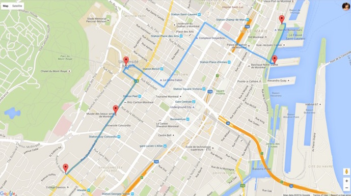

# Scenify

**TLDR**: Finds the most scenic route between two locations.

## What it Does

After a user selects two points on a map (current location and final destination), this finds the most scenic path to walk from point A to B. This allows for time-crunched tourists or local explorers to sightsee along the way of their route.

## How it Does it

We grab all point-of-interest images from Google Maps within the radius of the two locations chosen. Then, the images are rated by how scenic they are. An optimal path is created from the starting location, to the top scenic points of interests, and to the ending location.

The scenic rating system is built using Clarifai to generate identifier tags for each point-of-interest image, then uses 3net.js on these tags to rate the images. For instance, this app has been trained on outdoor images in Montreal, and thus considers an image with European-style architecture as a highly scenic/must-travel point of interest.

### Tools

- Node.js
- Express
- [Machine Learning](https://github.com/muntashir/Sceney)
	- Uses [Clarifai](https://www.clarifai.com/) Visual Recognition
	- Uses [3net.js](https://www.versioneye.com/nodejs/3net.js/0.1.0)
 Neural Networks